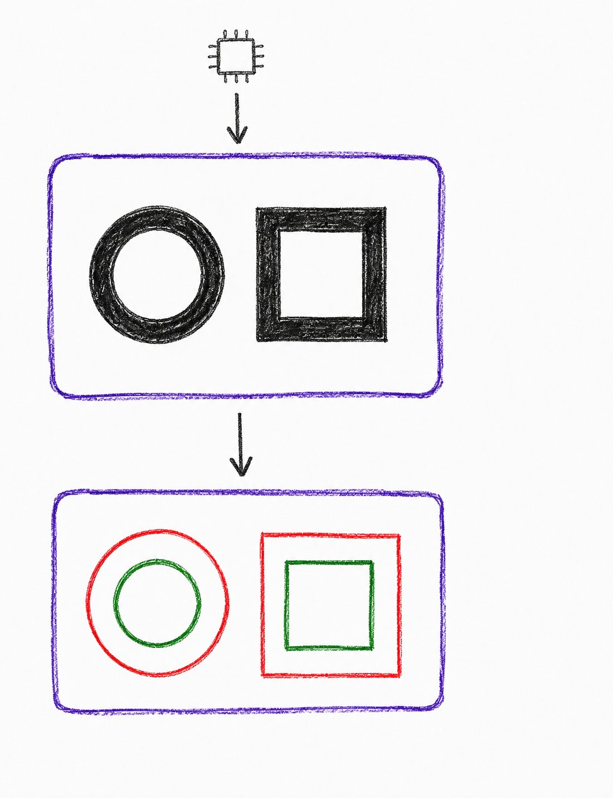
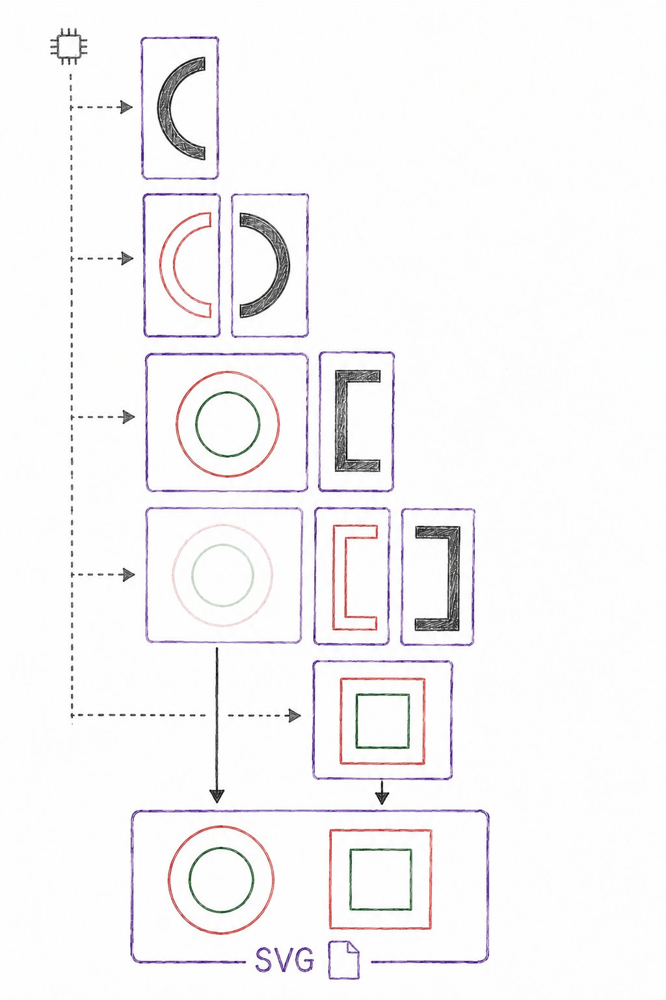

# contrek-python

Python bindings for [Contrek](https://github.com/runout77/contrek), a fast raster-to-vector polygon tracing engine written in C++. This wraps the C++ core with pybind11 so you can call it from Python without losing the performance. Coordinates come back as NumPy arrays and the underlying engine is multi-threaded. You can find more info in the main repo.

Wrapper is MIT. Core (vendored as a git submodule at `vendor/contrek`) is AGPLv3.

## Install

Source only, no prebuilt wheels — `pip install` compiles the core locally and tunes it for your CPU (`-march=native`, on by default in the core's own CMakeLists). Needs a C++17 compiler and CMake.

```bash
pip install contrek
```

For development (editable install, running tests):

```bash
git clone --recurse-submodules https://github.com/runout77/contrek-python.git
cd contrek-python
python3 -m venv .venv && source .venv/bin/activate
pip install -e ".[test]"
pytest
```

Linux/macOS only (POSIX threads).

## High-level API

Trace polygons from an image file in one call.

```python
import contrek

result = contrek.contour("image.png", number_ot_threads=4, number_ot_tiles=4, treemap=True)
print(result.groups, result.width, result.height)

for poly in result.polygons:
    print(poly.outer)   # numpy int32 (N, 2)
    print(poly.inner)   # list[numpy int32 (N, 2)]
    print(poly.bounds)  # {min_x, min_y, max_x, max_y, is_empty}
```

## Low-level API - Processing Modes

### Mode 1: Single-threaded processing

<table>
<tr>
<td width="40%" valign="top">

</td>
<td width="60%" valign="top">
The entire image is processed using a single core.

**Profile:** low speed; low memory efficiency.
<br><br>
<center></center>
</td></tr></table>

Trace polygons from a PNG file (`FastPngBitmap`).

```python
bitmap = contrek.FastPngBitmap("graphs_1024x1024.png")
result = contrek.find_polygons(
    bitmap,
    options={
      "versus": "clockwise",
      "bounds": True,
      "compress": {"linear": True}},
    target_color=contrek.rgb_to_target_color(255, 255, 255, 255),
    mode=contrek.MatchMode.EXACT_COLOR,
)
```

`versus` accepts `"a"` `"o"` for "anticlockwise"/"clockwise".


### Mode 2: Parallel processing

<table>
<tr>
<td width="40%" valign="top">

</td>
<td width="60%" valign="top">
The entire image is loaded first, then split into tiles and processed across multiple CPU cores. Partial results are progressively and dynamically merged: there is no predefined merge order, and adjacent pairs are processed as soon as they become available.
This mode prioritizes performance, using parallelism both for tile processing and for merging partial results.

**Profile:** maximum speed, with processing time decreasing as more cores become available; low memory efficiency.
<br><br>
<center></center>
</td></tr></table>

Use 4 threads and 4 tiles

```python
bitmap = contrek.FastPngBitmap("sample_10240x10240.png")
result = contrek.find_polygons(
    bitmap,
    number_of_threads=4,
    options={
      "number_of_tiles": 4,
      "versus": "o",
      "bounds": True,
      "compress": {"uniq": True, "linear": True},
    },
    target_color=contrek.rgb_to_target_color(255, 255, 255, 255),
    mode=contrek.MatchMode.NOT_COLOR
```

### Mode 3: Input streaming

<table>
<tr>
<td width="40%" valign="top">

</td>
<td width="60%" valign="top">
The image does not need to be loaded entirely into memory. Instead, it can be read progressively using a fixed-size buffer. For example, with a PNG source, this can be done using libspng's progressive decoding.
Adjacent tiles share an overlapping scanline to preserve geometry continuity across tile boundaries. Once all tiles have been added, the merge is performed (optionally using multiple threads) to reconstruct the complete geometry.
This mode provides a trade-off between performance and memory usage: the entire raster does not need to be kept in RAM, while the vector state required to build the final result is retained.

**Profile:** medium speed; medium-high memory efficiency.
<br><br>
<center></center>
</td></tr></table>

Trace polygons from two in-memory pattern strings (`Bitmap`, useful for synthetic tiles or tests).
Up is 6 rows height, down is 5 rows. Total after merging: 10 rows, because one row is the shared scanline

```python
  up =   (" 00000000000000               "
          " 00000000000000               "
          " 00          00               "
          " 00          00               "
          " 00          00               "
          " 00          00               ")

  down = (" 00          00               "
          " 00          00               "
          " 00          00               "
          " 00000000000000               "
          " 00000000000000               ")

  result_up = contrek.find_polygons_raw(
    contrek.Bitmap(up, 30),
    options={
      "versus": "a",
      "bounds": True,
    },
    target_color=ord("0"),
    mode=contrek.MatchMode.EXACT_COLOR
  )
  result_down = contrek.find_polygons_raw(
    contrek.Bitmap(down, 30),
    options={
      "versus": "a",
      "bounds": True,
    },
    target_color=ord("0"),
    mode=contrek.MatchMode.EXACT_COLOR
  )
  # results are obtained sequentially in the way you prefer
  # we collect geometry by add_tile()
  merger = contrek.VerticalMerger()
  merger.add_tile(result_up)
  merger.add_tile(result_down)

  # now finally calling process_info() you start merging and
  # get merged data
  result = merger.process_info()
  assert result["groups"] == 1
  assert result["width"] == 30
  assert result["height"] == 10
```

### Mode 4: End-to-end streaming

<table>
<tr>
<td width="40%" valign="top">

</td>
<td width="60%" valign="top">
This mode extends the incremental processing used in Mode 3 by streaming the output as well.
The image is read and processed one tile at a time. Each new tile is immediately merged with the current state. As processing moves forward, whenever a geometry is complete and can no longer be affected by subsequent tiles, it is finalized and written directly to the SVG file.
This limits both the amount of raster data kept in memory and the accumulation of generated vector geometries. It is particularly well suited to very large datasets or cases where the vector output itself can become significant in size.

**Profile:** low speed; maximum memory efficiency.
<br><br>
<center></center>
</td></tr></table>

Trace polygons from 4 in-memory pattern strings.

```python
  stripe1 =("00000000        "
            "00000000        "
            "00    00        "
            "00000000  000000"
            "00000000  000000"
            "          00  00")

  stripe2 =("          00  00"
            "          00  00"
            "0000000   00  00"
            "0000000   000000"
            "00   00   000000"
            "00   00         ")

  stripe3 =("00   00         "
            "00   00  0000000"
            "00   00  0000000"
            "00   00  00   00"
            "00   00  00   00"
            "00   00  0000000"
            "00   00  0000000"
            "00   00         ")

  stripe4 =("00   00         "
            "00   00         "
            "00   00         "
            "00   00         "
            "0000000         "
            "0000000         ")
  
  width = 16
  height = 23

  with tempfile.NamedTemporaryFile(suffix=".svg", delete=False) as shared_stream:
    temp_path = shared_stream.name

  try:
    merger = contrek.SvgStreamingMerger(
        options={"bounds": True},
        output_path=temp_path,
        width=width,
        height=height,
    )
    for i, stripe in enumerate(sample_stripes):
      bitmap = contrek.Bitmap(stripe, width)
      tile = contrek.find_polygons_raw(
        bitmap,
        options={
            "versus": "o",
            "bounds": True,
            "compress": {"uniq": True, "linear": True},
        },
        target_color=ord("0"),
        mode=contrek.MatchMode.EXACT_COLOR
      )
      is_last = (i == len(sample_stripes) - 1)
      merger.add_tile(tile, flush=is_last)
    # finally obtain accumulated geometry
    result = merger.process_info()
```

## Building results from raw polygon data

`make_result_from_polygons(polygons, width, height)` builds a `RawProcessResult` straight from polygon coordinates you already have — no bitmap or tracing involved. Useful for testing mergers, or feeding in geometry computed elsewhere.

## Tests

`tests/` also doubles as usage examples — see the various `test_*.py` files for more ways to call the API.

## License

- Wrapper: MIT (`LICENSE`)
- Core (submodule): AGPLv3 — [details](https://github.com/runout77/contrek#license)